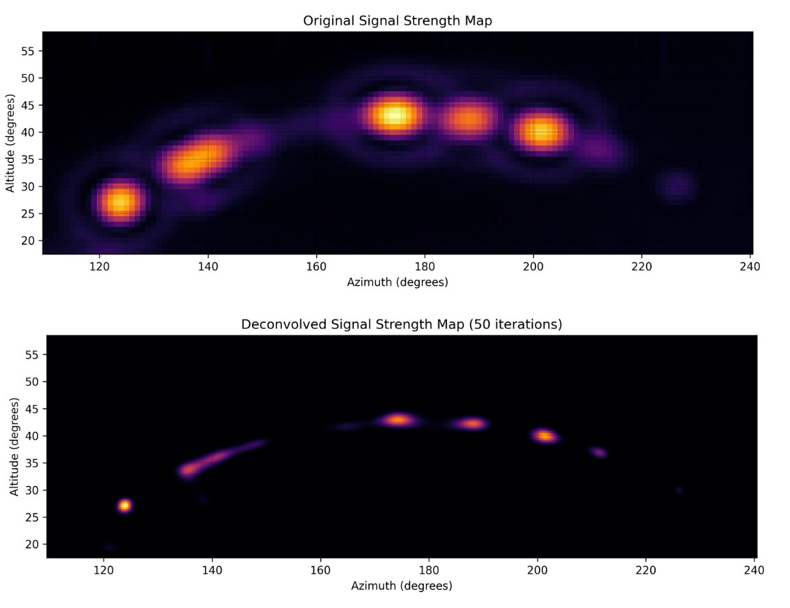

# Signal Strength Filter Tool

Python code to use a deconvolution to filter RSSI data from "winegard-sky-scan" data to ideally enhance the data assuming the data is diffraction limited. It uses an Airy disk (https://en.wikipedia.org/wiki/Airy_disk) as the expected Point spread function (PSF) (https://en.wikipedia.org/wiki/Point_spread_function) for the radio telescope setup. The satellietes should effectively be point sources as they are so small and far away. Using these assumptions you should be able to "deblur" or recreate the actual data.




## Features

- 2D grid interpolation for higher resolution analysis
- Airy pattern fitting to characterize signal properties
- Richardson-Lucy deconvolution to enhance signal resolution
- Ability to use external point spread function (PSF) parameters

## Installation

1. Clone this repository:
   ```
   git clone https://github.com/C4KEW4LK/RSSI_data_deconv.git
   cd signal-strength-analysis
   ```

2. Install required dependencies:
   ```
   pip install -r requirements.txt
   ```

## Usage

### Command Line Interface

The tool can be run directly from the command line:

```bash
python signal_processor.py data_file.txt [OPTIONS]
```

#### Options:

- `--iterations INT`: Number of deconvolution iterations (default: 10)
- `--roi FLOAT`: Region of interest width in degrees (default: 15)
- `--interp INT`: Interpolation factor (default: 3)
- `--search AZ_MIN AZ_MAX ALT_MIN ALT_MAX`: Search bounds for finding maximum signal
- `--save-plots`: Save visualization plots
- `--output-dir DIR`: Directory to save output files
- `--quiet`: Suppress output messages
- `--external-psf FILE`: Path to external PSF parameters file
- `--export-psf`: Export the PSF parameters to a text file

### As a Python Module

```python
from signal_processor import process_signal_data

# Process from file
results = process_signal_data(
    file_path='sample_data.txt', 
    deconv_iterations=10, 
)

# Or process from arrays
results = process_signal_data(
    data_arrays=(azimuth_array, altitude_array, signal_array),
    deconv_iterations=10, 
)
```

## Input Data Format

The input file should be a space-separated text file with three columns:
1. Azimuth (degrees)
2. Altitude (degrees)
3. Signal strength

Example:
```
174.0 40.0 0.1234
174.5 40.0 0.2345
175.0 40.0 0.3456
...
```

## Outputs

- Original signal strength map (`original_signal_strength.png`)
- Interpolated signal strength map (`interpolated_signal_strength.png`)
- Deconvolved signal strength map (`deconvolved_signal_strength.png`)
- PSF kernel visualization (`psf_kernel.png`)
- Deconvolved data as text file (`deconvoluted_data.txt`)
- PSF parameters file (`psf_parameters.txt`)

## Examples

### Basic Usage

```bash
python signal_processor.py telescope_data.txt --save-plots --output-dir results
```

### Using External PSF Parameters

```bash
python signal_processor.py new_data.txt --external-psf previous_psf_parameters.txt
```

### Specifying Region of Interest

```bash
python signal_processor.py signal_data.txt --roi 10 --search 170 180 35 45
```

## How It Works

1. **Data Loading**: Loads raw signal strength measurements from a file or provided arrays.
2. **Grid Creation**: Converts scattered data points into a 2D grid.
3. **Interpolation**: Creates a higher-resolution grid using cubic spline interpolation.
4. **Maximum Finding**: Identifies the location of maximum signal strength.
5. **Airy Pattern Fitting**: Fits a 2D Airy pattern to characterize the signal.
6. **PSF Creation**: Generates a Point Spread Function kernel based on the Airy pattern.
7. **Deconvolution**: Applies Richardson-Lucy deconvolution to enhance signal resolution.
8. **Visualization**: Creates plots of the original, interpolated, and deconvolved data.

## Notes

- The Airy pattern fitting assumes a diffraction-limited optical system.
- The Richardson-Lucy deconvolution may amplify noise if too many iterations are used.
- For best results, ensure your input data has good sampling across both azimuth and altitude.

## License

[MIT License](LICENSE)